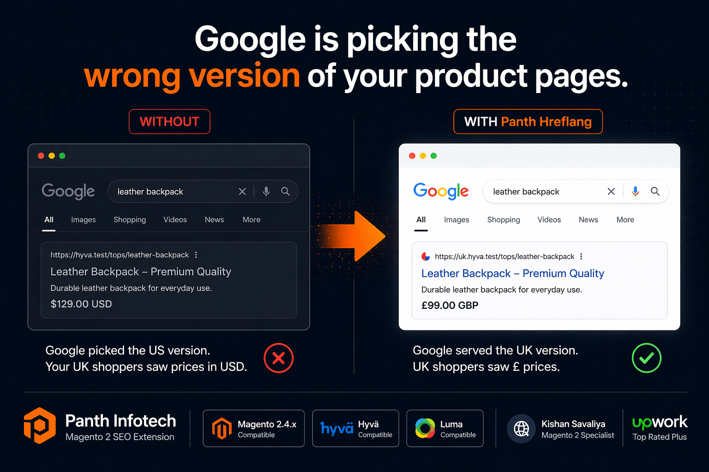
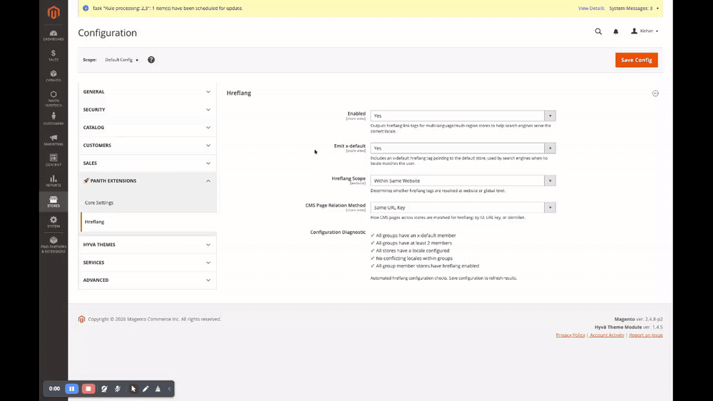
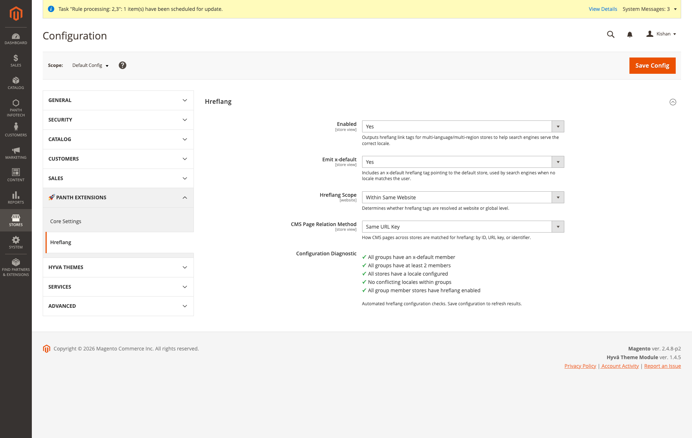
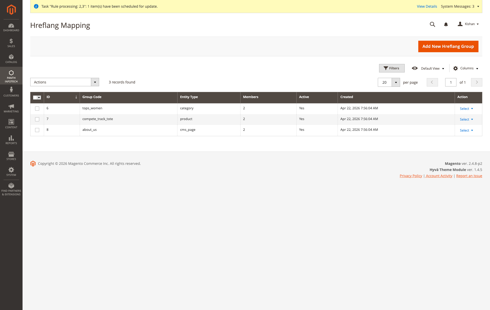
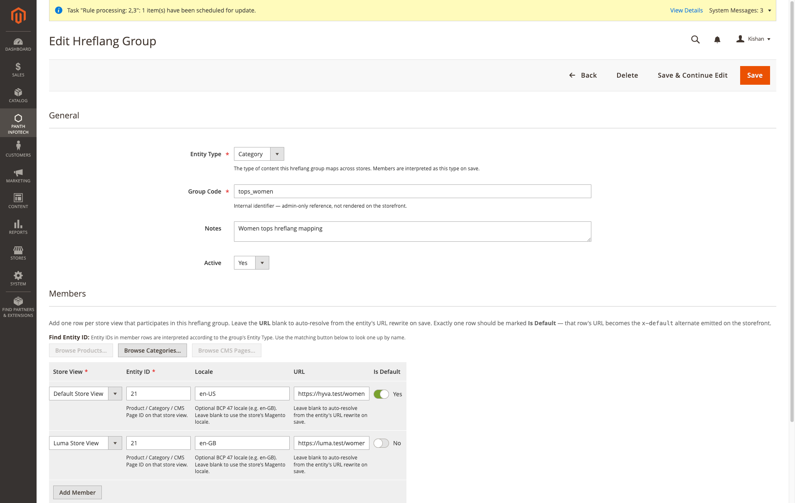

<!-- SEO Meta -->
<!--
  Title: Panth Hreflang — Multi-Language / Multi-Region Hreflang Link Tags for Magento 2 (Hyva + Luma)
  Description: Full hreflang management for Magento 2. Admin CRUD for cross-store hreflang groups covering products, categories and CMS pages, with automatic x-default emission, locale fallback to the store's Magento locale, URL auto-resolution from url_rewrite, a three-way CMS relation strategy (by_url_key / by_id / by_identifier), per-website or global scope, a config-page self-diagnostic, and theme-agnostic storefront rendering — works identically on Hyva and Luma with zero template overrides.
  Keywords: magento 2 hreflang, magento hreflang module, magento multi-language seo, magento x-default, cross-store hreflang, magento multi-region seo, hyva hreflang, luma hreflang, magento hreflang cms pages, magento hreflang products, magento hreflang categories, panth hreflang
  Author: Kishan Savaliya (Panth Infotech)
-->

# Panth Hreflang — Multi-Language / Multi-Region Hreflang Link Tags for Magento 2 (Hyva + Luma)

[](https://magento.com)
[](https://php.net)
[](https://hyva.io)
[]()
[](https://packagist.org/packages/mage2kishan/module-hreflang)
[](https://www.upwork.com/freelancers/~016dd1767321100e21)
[](https://kishansavaliya.com)
[](https://kishansavaliya.com/get-quote)

<p align="center">
  
</p>

> **Every multi-store Magento catalog gets hreflang wrong the first time.** The core `Magento_Store` module does not emit `<link rel="alternate" hreflang>` tags on any page, so Google treats two localized versions of `/women/tops` as duplicate content and picks one to index — arbitrarily. **Panth Hreflang** adds the missing layer: admin-managed groups that pair any `product`, `category` or `cms_page` across store views, automatic `x-default` emission, locale fallback to the store's Magento locale (`general/locale/code` converted to BCP 47), URL auto-resolution from `url_rewrite` on save, a three-way CMS matching strategy for the common case where you don't need to create a group per page, and a self-diagnostic on the config page that flags common misconfigurations before you ship. Theme-agnostic — the rendering path is a head block + plain phtml, so the exact same `<link>` tags ship on Hyva and Luma with zero template overrides.

Single-locale stores still benefit: the ViewModel emits a self-referencing `x-default` so the page always declares its intent to search engines. Store-assignment edge cases (a product that exists on store 1 and 3 but not 2) are handled by the scope setting — `website` restricts hreflang to stores in the same website, `global` includes every storefront store. Deactivating a group from the grid immediately stops its tags from rendering, so you can stage content without forcing a cache flush.

---

## Demo

End-to-end admin flow — open Configuration, confirm the diagnostic is all green, navigate to the Hreflang Mapping grid, add a new group, pick the entity type, add two members with the store / ID / locale / URL / default fields, and save. Click to play.



---

## Need Custom Magento 2 Development?

<p align="center">
  <a href="https://kishansavaliya.com/get-quote">
    
  </a>
</p>

<table>
<tr>
<td width="50%" align="center">

### Kishan Savaliya
**Top Rated Plus on Upwork**

[](https://www.upwork.com/freelancers/~016dd1767321100e21)

</td>
<td width="50%" align="center">

### Panth Infotech Agency

[](https://www.upwork.com/agencies/1881421506131960778/)

</td>
</tr>
</table>

---

## Table of Contents

- [Preview](#preview)
- [Features](#features)
- [How It Works](#how-it-works)
- [Compatibility](#compatibility)
- [Installation](#installation)
- [Verify](#verify)
- [Configuration](#configuration)
- [Managing Hreflang Groups](#managing-hreflang-groups)
- [Storefront Rendering](#storefront-rendering)
- [Testing Your Hreflang Tags](#testing-your-hreflang-tags)
- [Troubleshooting](#troubleshooting)
- [Support](#support)

---

## Preview

### Admin

**System configuration** — **Stores → Configuration → Panth Extensions → Hreflang**. Four store-scoped toggles (Enabled, Emit x-default, Hreflang Scope, CMS Page Relation Method) plus an automated Configuration Diagnostic panel that checks every group has an x-default member, every group has at least two members, every participating store has a locale configured, no two members in the same group share a locale, and every member store has hreflang enabled.



**Hreflang Mapping grid** — one row per group with columns for ID, Group Code, Entity Type (product / category / cms_page), Members (aggregate count of linked store rows), Active flag, Created timestamp and per-row Edit / Delete actions. Mass actions let you enable, disable or delete groups in bulk.



**Edit Hreflang Group form** — General fieldset with Entity Type, Group Code, Notes and Active toggle, plus a Members fieldset with a dynamicRows editor that adds one row per store view. Each row carries Store View, Entity ID, Locale (blank falls back to the store's Magento locale), URL (blank auto-resolves from `url_rewrite` on save) and an Is Default toggle that drives the `x-default` emission. The toolbar above the grid has Browse Products / Browse Categories / Browse CMS Pages buttons — each one dims when the group's Entity Type doesn't match, and opens a searchable modal so admins can look up the right ID by name.



---

## Features

| Feature | Description |
|---|---|
| **Hreflang group CRUD** | Every row in `panth_seo_hreflang_group` pairs a canonical Entity Type (`product`, `category` or `cms_page`), Group Code (admin-only identifier), Notes (free-text context) and Active flag. Deactivating a group stops its tags from rendering on the next request without deleting the data — useful for staging hreflang work or quickly backing out a bad mapping. |
| **Members editor** | `panth_seo_hreflang_member` rows are edited inline on the group form via a `dynamicRows` UI component. Each row holds Store View (FK to `store.store_id`), Entity ID (product / category / cms_page ID in that store), Locale (optional BCP 47 override), URL (optional absolute URL override) and Is Default (drives `x-default`). Rows can be added, edited, deleted, and round-trip correctly through Save & Continue Edit. |
| **Locale fallback** | When a member row's Locale is blank, the resolver reads the store's `general/locale/code`, converts underscore to hyphen (`en_US` → `en-US`), and uses that. So a simple group creation on an existing multi-store install needs zero explicit locale entry — just pick the Store View and Entity ID. |
| **URL auto-resolution** | When a member row's URL is blank, the Save controller looks up `url_rewrite` for that entity + store, prepends the store's base URL, and stores the absolute URL. Updates to the entity's URL key are not automatically tracked — re-save the group (or click Save on the relevant group) after a URL rewrite change to refresh the members. |
| **x-default handling** | One member per group can be flagged Is Default. That member's URL is emitted as the `x-default` alternate in addition to its locale-specific row, matching Google's [hreflang best practice](https://developers.google.com/search/docs/specialty/international/localized-versions) of always carrying a fallback for users whose locale doesn't match any other entry. When no row is flagged default, the first member's URL is used. |
| **Three CMS matching strategies** | CMS pages are special — they often exist under the same identifier across stores, so manual group creation is wasteful. `cms_relation_method = by_url_key` (default) matches CMS pages across stores by their `identifier` column; `by_id` matches by numeric `page_id`; `by_identifier` falls through to the manual group table. Per-store-view configurable. |
| **Per-website or global scope** | `hreflang_scope = website` (default) restricts alternates to stores within the same website as the current request. `global` includes every active storefront store regardless of website. Relevant when two independent brands share one Magento install but shouldn't cross-link. |
| **Self-diagnostic** | `Model\Hreflang\Diagnostic::runDiagnostics()` runs five checks against the live DB every time the config page is loaded — x-default coverage, group size, store locale configuration, locale conflicts inside groups, hreflang-enabled status of each member's store — and renders the results inline on the config page. Errors flag real problems; warnings flag best-practice deviations. |
| **Entity finder modal** | The edit form has a Browse Products / Browse Categories / Browse CMS Pages toolbar. Each button opens a searchable modal (matches by name / SKU / identifier / numeric ID) and copies the clicked entity's ID to the clipboard with a quick amber flash. The buttons dim when they don't match the group's Entity Type — no browsing categories for a product-typed group. |
| **Theme-agnostic storefront** | `ViewModel\Hreflang` computes alternates once per request. `view/frontend/layout/default.xml` attaches the head block to the `head.additional` reference container, so the exact same `<link>` tags ship on Hyva, Luma, and any custom theme — no template overrides, no theme-specific JS, no Alpine / RequireJS integration needed. |
| **Accurate entity detection** | The ViewModel detects the current entity via registry (`current_product` / `current_category`) first, falling back to `full_action_name` matching for CMS pages (`cms_index_index` reads the home page identifier from store config; `cms_page_view` reads `page_id` from the request). The core `cms_page` registry key is only populated by the admin edit controller — using it on the storefront would miss every request, so we don't. |
| **Active-flag enforcement** | The resolver joins `panth_seo_hreflang_group` on the member lookup and filters `is_active = 1`. Flipping a group to Active = No in the grid immediately hides its tags on the next request. |
| **Same-locale deduplication** | When two stores share a locale (e.g. two USD-denominated stores both using `en_US`), emitting duplicate hreflang entries would confuse crawlers. The resolver detects `<2 distinct locales` and returns an empty alternate list, letting the ViewModel fall back to a clean self-referencing `x-default`. |
| **Store-aware URL rewrite lookup** | For CMS matching via `by_url_key` / `by_id`, the resolver joins `cms_page_store` and converts each store's identifier back into an absolute URL by combining the per-store base URL with `url_rewrite.request_path`. Works correctly on multi-domain setups where each store has its own apex host. |

---

## How It Works

Four cooperating pieces:

1. **`ViewModel\Hreflang`** is the storefront entry point. On every page render, `view/frontend/layout/default.xml` attaches a head block with `Panth_Hreflang::head/hreflang.phtml`; the template calls `$block->getAlternates()` which delegates to the ViewModel. The ViewModel detects the current entity (product / category / CMS) via the core Magento registry + controller action name, calls the resolver, and returns an array of `{locale, url, is_default}` rows which the template walks to emit `<link rel="alternate" hreflang="…" href="…"/>` tags. Falls back to a self-referencing `x-default` when no group matches.
2. **`Model\Hreflang\Resolver`** is the read path. Given `(entity_type, entity_id, store_id)` it (a) short-circuits when `isHreflangEnabled(storeId)` is false, (b) routes CMS pages through `resolveCmsByRelation` when the relation method is `by_url_key` or `by_id`, (c) otherwise joins `panth_seo_hreflang_member` with `panth_seo_hreflang_group` to find the active group for the entity, (d) loads every member of that group within the configured scope, (e) dedupes by locale, (f) guards against `<2 distinct locales`, and (g) emits the `x-default` alternate when configured and no explicit `x-default` row exists.
3. **`Controller\Adminhtml\Hreflang\Save`** is the write path. It updates the `panth_seo_hreflang_group` row, then calls `syncMembers()` which reconciles the submitted `hreflang_members` payload against the existing DB rows — inserting new members, updating changed ones, and deleting any existing row whose ID isn't present in the submission. Blank Locale fields fall back to the store's Magento locale; blank URL fields resolve via `UrlFinderInterface::findOneByData(...)` against `url_rewrite`.
4. **`Controller\Adminhtml\Hreflang\EntitySearch`** backs the Browse Products / Browse Categories / Browse CMS Pages modals. Given `type`, `q` (search term) and `store_id`, it runs a scoped EAV query joining the name varchar table and returns up to 50 matches as JSON `[{id, label, url}]`. De-duplicated by entity ID, supports numeric-ID fast-path, and honors each store's name values via `store_id IN (0, <current>)`.

---

## Compatibility

| Requirement | Supported |
|---|---|
| Magento Open Source | 2.4.4, 2.4.5, 2.4.6, 2.4.7, 2.4.8 |
| Adobe Commerce | 2.4.4 — 2.4.8 |
| PHP | 8.1, 8.2, 8.3, 8.4 |
| Hyva Theme | 1.0+ (fully compatible — no theme overrides) |
| Luma Theme | Native support |
| Panth Core | ^1.0 (installed automatically) |

---

## Installation

```bash
composer require mage2kishan/module-hreflang
bin/magento module:enable Panth_Core Panth_Hreflang
bin/magento setup:upgrade
bin/magento setup:di:compile
bin/magento cache:flush
```

---

## Verify

```bash
bin/magento module:status Panth_Hreflang
# Module is enabled

# Home page should emit at least a self-referencing x-default even on a single-store install
curl -ks https://your-store.test/ | grep -oE '<link rel="alternate"[^>]+>'
# <link rel="alternate" hreflang="x-default" href="https://your-store.test/home" />

# After creating a group with two members the same URL should emit the full set
curl -ks https://your-store.test/women/tops-women.html | grep -oE '<link rel="alternate"[^>]+>'
# <link rel="alternate" hreflang="en-US" href="https://your-store.test/women/tops-women.html" />
# <link rel="alternate" hreflang="en-GB" href="https://uk.your-store.test/women/tops-women.html" />
# <link rel="alternate" hreflang="x-default" href="https://your-store.test/women/tops-women.html" />
```

Visit **Admin → Panth Infotech → Hreflang → Hreflang Mapping** to reach the grid, and **Stores → Configuration → Panth Infotech → Hreflang** to see the Configuration Diagnostic panel.

---

## Configuration

Navigate to **Stores → Configuration → Panth Infotech → Hreflang**.

| Setting | Path | Default | What it controls |
|---|---|---|---|
| **Enabled** | `panth_hreflang/hreflang/enabled` | Yes | Master switch at store-view scope. When No, the head block returns an empty alternates array and no `<link rel="alternate">` tags are emitted for that store. |
| **Emit x-default** | `panth_hreflang/hreflang/emit_x_default` | Yes | When Yes, every group with ≥2 distinct locales additionally emits a `hreflang="x-default"` row pointing at the `is_default` member (or the first member if none is flagged). When No, only locale-specific rows are emitted. |
| **Hreflang Scope** | `panth_hreflang/hreflang/hreflang_scope` | Within Same Website | `website` restricts alternates to the stores in the same website as the current request; `global` includes every active storefront store. Controls which members of a group participate when the site runs multiple independent brands on one Magento install. |
| **CMS Page Relation Method** | `panth_hreflang/hreflang/cms_relation_method` | Same URL Key | `by_url_key` (default) auto-matches CMS pages across stores by `cms_page.identifier`; `by_id` auto-matches by `cms_page.page_id`; `by_identifier` (misnamed for legacy reasons — it means "by manual group") bypasses the automatic matchers and only serves alternates from `panth_seo_hreflang_group` entries of type `cms_page`. Useful when different localized CMS pages intentionally have different identifiers. |

The **Configuration Diagnostic** panel runs five read-only checks every time the page loads — x-default presence, member count, store locale coverage, locale-conflict-within-group, and hreflang-enabled status of every participating store — so misconfigurations surface immediately in the admin UI rather than silently shipping to production.

---

## Managing Hreflang Groups

Open **Admin → Panth Infotech → Hreflang → Hreflang Mapping** to reach the grid (route `panth_hreflang/hreflang/index`).

### Group fields

| Field | Description |
|---|---|
| **Entity Type** | `product`, `category` or `cms_page`. Selected once at the group level; every member row in that group is interpreted as this type on save. Driven by `Model\Config\Source\EntityType`. |
| **Group Code** | Admin-only identifier. Not rendered on the storefront. Handy for distinguishing `tops_us_uk` from `tops_de_fr` in the grid. |
| **Notes** | Free-text. Store the reason for the grouping decision so a future admin knows why `entity_id = 21` on store 1 is linked to `entity_id = 47` on store 2. |
| **Active** | Per-group toggle. Deactivating a group immediately hides its tags on the next request (no cache flush needed). |

### Member fields

Each member row in the dynamicRows editor carries:

| Field | Description |
|---|---|
| **Store View** | FK to `store.store_id`. One row per store view that participates in this hreflang group. |
| **Entity ID** | The entity's numeric ID on that specific store view. IDs can differ per store (a localized product may live at `entity_id = 9` on store 1 and `entity_id = 143` on store 2) and this field stores them separately. |
| **Locale** | Optional BCP 47 locale (e.g. `en-GB`, `fr-FR`). Leave blank to fall back to the store's Magento locale (`general/locale/code` with underscore converted to hyphen). Override when you need region specificity beyond what Magento's locale code gives you. |
| **URL** | Optional absolute URL. Leave blank to auto-resolve from `url_rewrite` for that entity + store on save. Fill in manually for CDN domains, AMP alternates, or staging-to-production URL cutovers. |
| **Is Default** | Toggle. Exactly one row per group should be flagged — that row's URL becomes the `x-default` alternate emitted to search engines. |

### Entity finder modal

Above the members editor there is a Browse Products / Browse Categories / Browse CMS Pages toolbar. Only the button matching the current Entity Type is enabled; the other two dim to 40% opacity. Click the active button to open a searchable modal (matches by name, SKU, identifier, or numeric ID), click a row to copy its ID to the clipboard with a brief amber flash as confirmation, then paste into the relevant Entity ID field.

### Mass actions

The grid's Actions dropdown supports Delete for selected rows. Activation flip + bulk edit are handled inline on the edit form.

---

## Storefront Rendering

`view/frontend/layout/default.xml` attaches the head block to `head.additional`:

```xml
<referenceBlock name="head.additional">
  <block class="Panth\Hreflang\Block\Head\Hreflang"
         name="panth_hreflang.head"
         template="Panth_Hreflang::head/hreflang.phtml"
         cacheable="true">
    <arguments>
      <argument name="view_model" xsi:type="object">Panth\Hreflang\ViewModel\Hreflang</argument>
    </arguments>
  </block>
</referenceBlock>
```

The template is plain PHP — no Alpine, no RequireJS, no mage-init — so the exact same tags render on Hyva and Luma. Output for a group-matched product page:

```html
<link rel="alternate" hreflang="en-US" href="https://your-store.test/compete-track-tote.html" />
<link rel="alternate" hreflang="en-GB" href="https://uk.your-store.test/compete-track-tote.html" />
<link rel="alternate" hreflang="x-default" href="https://your-store.test/compete-track-tote.html" />
```

Output on a page that has no matching group (single-locale install, unmatched entity, etc.):

```html
<link rel="alternate" hreflang="x-default" href="https://your-store.test/current-page" />
```

The block is cacheable — hreflang output ends up in full-page cache alongside the rest of the `<head>` and costs nothing per-request after the first uncached render.

---

## Testing Your Hreflang Tags

A working hreflang setup requires the tags to be **mutually referencing** (if A links to B, B must link back to A) and every referenced URL must be reachable. Validate both.

### In-browser spot check

Open any storefront URL and run in DevTools console:

```js
[...document.querySelectorAll('link[rel="alternate"][hreflang]')]
  .map(l => `${l.hreflang} → ${l.href}`)
```

Should return an array with at least `x-default` on any page, and the full set of locale-specific rows for any group-matched page.

### Google Search Console

The authoritative validator. Google Search Console → Legacy Tools → International Targeting. Each verified property surfaces hreflang errors (missing return link, invalid locale codes, no x-default, etc.) for every URL it has crawled. Use this as the source of truth after ten days of crawl activity.

### External testing tools

Great for before-deploy sanity checks — just paste a URL:

- **[Merkle Hreflang Testing Tool](https://technicalseo.com/tools/hreflang/)** — checks tag format, locale validity, and return-link presence for every URL in a bulk list.
- **[Ahrefs Hreflang Checker](https://ahrefs.com/writing-tools/hreflang-checker)** — free single-URL tester with a clean error report.
- **[hreflang.org Generator & Validator](https://www.hreflang.org/)** — generator + validator, useful when building a migration plan.
- **[Screaming Frog](https://www.screamingfrog.co.uk/seo-spider/)** — SEO Spider (paid, free under 500 URLs) crawls the whole site and produces a Hreflang report listing missing return links, locale mismatches, unreachable alternates, and duplicate entries.
- **[Sitebulb](https://sitebulb.com/)** — similar crawl-based audit with a Hreflang hint card covering the same checks as Screaming Frog.

### CI smoke test

A minimal curl-based test you can wire into CI:

```bash
for url in / /women/tops-women.html /compete-track-tote.html /about-us; do
  count=$(curl -ks "https://your-store.test${url}" | grep -c '<link rel="alternate"')
  if [ "$count" -lt 1 ]; then
    echo "FAIL  ${url}  0 hreflang tags"; exit 1
  fi
  echo "OK    ${url}  ${count} hreflang tags"
done
```

Run it after every deploy that touches hreflang or URL rewrites.

---

## Troubleshooting

### No hreflang tags on the storefront

Three things to check, in order:

1. **Master switch** — *Stores → Configuration → Panth Infotech → Hreflang → Enabled = Yes* at the current store scope. When No, the head block returns an empty alternates array and zero tags render. Flush `config` + `full_page` caches after flipping.
2. **Active group** — open the Hreflang Mapping grid, confirm the group covering this entity has Active = Yes. Deactivated groups stay in the DB for audit but are filtered out by the resolver.
3. **Store locale configured** — every participating store view needs `general/locale/code` set at store scope. A missing locale makes the resolver skip that member row because it can't build a valid BCP 47 locale to emit.

### `x-default` tag is missing

Check *Stores → Configuration → Panth Infotech → Hreflang → Emit x-default = Yes*. When No, only locale-specific rows are emitted and the `x-default` row is suppressed — that's the config behaving as documented. When Yes and the tag is still missing, confirm the group has ≥2 distinct locales (same-locale groups return an empty alternate list on purpose, to avoid duplicate-content signals) and that one member is flagged Is Default.

### Tags render but URLs are wrong after a category rename

The member rows store absolute URLs resolved at save time. Renaming a category updates `url_rewrite` but does not re-walk every hreflang group. Open the affected group and click Save — the Save controller re-resolves blank URLs (and re-saves explicit URLs unchanged). Or run the admin mass-resave once after a bulk URL-key migration. A future automatic re-resolve on `url_rewrite` change event is on the roadmap.

### CMS pages not picking up alternates even though the groups exist

Confirm the CMS Page Relation Method. When set to `by_url_key` or `by_id`, the resolver bypasses the group table entirely for CMS pages — so a manually-created CMS group won't apply. Flip the config to `by_identifier` (admin label: *By Identifier (manual group)*) to have the resolver use the group table.

### `Entity Type` select not showing on the edit form

Two causes: (a) the compiled ui_component config is stale from before v1.0.6 — run `bin/magento cache:flush && rm -rf var/view_preprocessed generated/code/Panth` and hard-refresh the admin page; (b) the source model `Panth\Hreflang\Model\Config\Source\EntityType` didn't get autoloaded — run `composer dump-autoload -o` and re-flush.

### Members editor shows column headers but no rows for an existing group

The dynamicRows JS requires `recordTemplate=record` declared in the form XML under `<argument><item name="recordTemplate">…</item></argument>`. Versions before v1.0.7 shipped it as a `<settings>` child which some Magento builds silently ignore — upgrade to v1.0.7+.

### Same-locale stores show only `x-default`

By design. When two stores in a group share a locale (e.g. both `en_US`), emitting duplicate hreflang entries would confuse search engines into treating one as the canonical. The resolver returns an empty alternate list in that case and the ViewModel falls back to a clean self-referencing `x-default`. Assign distinct locale codes on each store (`en_US`, `en_GB`, `en_AU` etc.) or override the Locale field on each member row to differentiate them.

---

## Support

- **Agency:** [Panth Infotech on Upwork](https://www.upwork.com/agencies/1881421506131960778/)
- **Direct:** [kishansavaliya.com](https://kishansavaliya.com) — [Get a free quote](https://kishansavaliya.com/get-quote)
