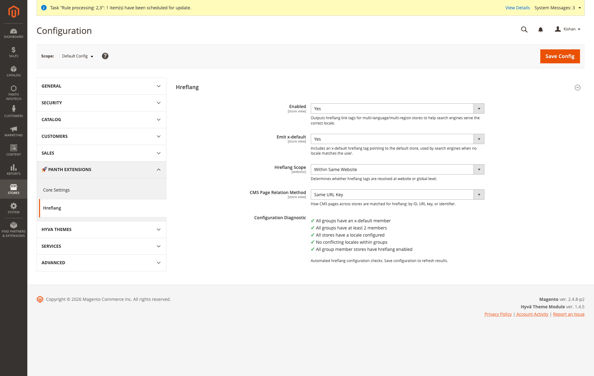
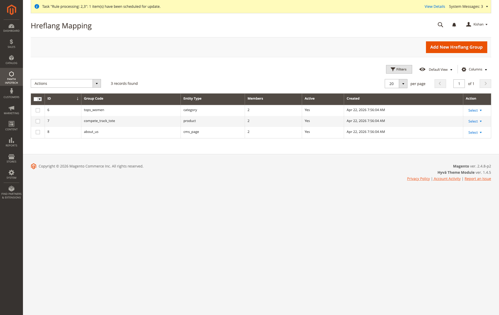
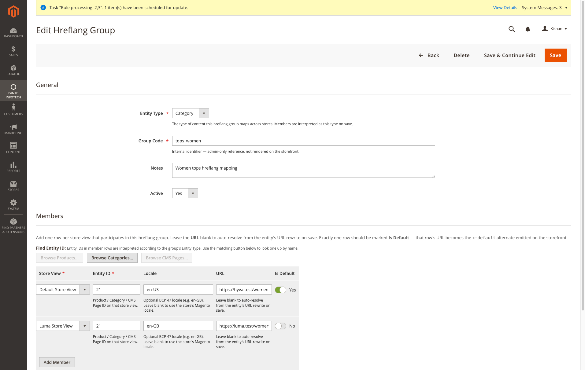

# Magento 2 Hreflang

Panth Hreflang adds `<link rel="alternate" hreflang="...">` tags to the `<head>` of storefront pages so that search engines can serve the correct language or region version of a product, category or CMS page. Magento 2 does not emit hreflang tags on its own; this module adds a single head block on the default layout handle and fills it from admin-managed hreflang groups, or, for CMS pages, from an automatic match across store views.

It is used by merchants who run several store views for different languages or countries on one Magento installation. The output is rendered by a plain PHP template with no JavaScript, so it works on both Hyva and Luma themes.

Product page: [kishansavaliya.com/magento-2-hreflang.html](https://kishansavaliya.com/magento-2-hreflang.html)



## Features

- Emits one `<link rel="alternate" hreflang="..." href="..."/>` tag per locale on product, category and CMS pages, including the CMS home page.
- Admin grid and form for hreflang groups: each group has an entity type (Product, Category or CMS Page), a code, notes, an active flag and any number of member rows (Store View, Entity ID, Locale, URL, Is Default).
- Locale fallback: when a member's Locale field is left blank, the store's `general/locale/code` value is used with the underscore replaced by a hyphen (for example `en_GB` becomes `en-GB`).
- URL auto-resolution: when a member's URL field is left blank, the URL is built on save from the entity's `url_rewrite` entry for that store.
- Entity lookup modals on the group form (Browse Products, Browse Categories, Browse CMS Pages) that search by name, SKU, identifier or numeric ID and return up to 50 rows.
- Optional `x-default` tag: taken from the member flagged Is Default, or from the first member when none is flagged. When no group matches the current page, a single self-referencing `x-default` tag is emitted instead (not on the 404 page).
- Scope control: alternates can be limited to store views in the same website (default) or include store views from all websites.
- Three CMS page matching methods: Same Page ID, Same URL Key (default) or By Hreflang Identifier (manual groups only).
- Configuration Diagnostic panel on the configuration page that runs five checks against the stored groups and store settings.
- Mass delete from the grid; deleting a group also deletes its member rows (foreign key with `ON DELETE CASCADE`).
- Keyword search on the grid (group code, entity type, notes).
- Indexer `panth_seo_hreflang` (label "Panth SEO Hreflang") with Mview subscriptions on the two module tables.
- Data patch that renames legacy `panth_seo/hreflang/*` configuration paths to `panth_hreflang/hreflang/*` during `setup:upgrade`.
- Constructor dependency injection only; all admin labels and messages use `__()` for translation.

## Compatibility

| Platform | Versions |
|---|---|
| Magento Open Source | 2.4.4 to 2.4.8 (as published on the product page) |
| Adobe Commerce | 2.4.4 to 2.4.8 (as published on the product page) |
| PHP | 8.1, 8.2, 8.3, 8.4 (`~8.1.0||~8.2.0||~8.3.0||~8.4.0` in `composer.json`) |
| Themes | Hyva and Luma (server-rendered template, no JavaScript) |

Composer constraints on Magento packages: `magento/framework ^103.0`, `magento/module-store ^101.1`, `magento/module-catalog ^104.0`, `magento/module-cms ^104.0`, `magento/module-backend ^102.0`, `magento/module-ui ^101.2`, `magento/module-config ^101.2`, `magento/module-url-rewrite ^102.0`.

## Requirements

- Magento Open Source or Adobe Commerce 2.4.4 to 2.4.8
- PHP 8.1, 8.2, 8.3 or 8.4
- `mage2kishan/module-core` `^1.0` (required; provides the Panth Extensions admin tab and menu parent)
- The Magento modules listed above; `Magento_Catalog`, `Magento_Cms`, `Magento_Backend` and `Magento_Ui` are also declared in the `module.xml` load sequence

## Installation

```bash
composer require mage2kishan/module-hreflang
bin/magento module:enable Panth_Core Panth_Hreflang
bin/magento setup:upgrade
bin/magento setup:di:compile
bin/magento cache:flush
```

`setup:di:compile` is only needed in production mode. The module ships no files under `view/*/web`, so `setup:static-content:deploy` is not required.

Check the result with:

```bash
bin/magento module:status Panth_Hreflang
```

## Configuration

Go to Stores > Configuration > Panth Extensions > Hreflang. The section is also reachable from the admin menu under Panth Extensions > Hreflang > Configuration.

### Hreflang

| Setting | Default | What it does |
|---|---|---|
| Enabled | Yes | Master switch. When set to No for a store view, the head block outputs nothing on that store view. |
| Emit x-default | Yes | Adds an `x-default` tag to every resolved group that does not already contain a member with locale `x-default`. |
| Hreflang Scope | Within Same Website | `Within Same Website` restricts alternates to store views of the current website; `Across All Websites` includes members from every website. Available at default and website scope only. |
| CMS Page Relation Method | Same URL Key | How CMS pages are matched across store views: `Same Page ID`, `Same URL Key` (pages sharing the same identifier) or `By Hreflang Identifier` (only manually created groups are used). |
| Configuration Diagnostic | (read-only) | Shows the result of five checks. Save the configuration to refresh it. |

Configuration paths:

- `panth_hreflang/hreflang/enabled`
- `panth_hreflang/hreflang/emit_x_default`
- `panth_hreflang/hreflang/hreflang_scope`
- `panth_hreflang/hreflang/cms_relation_method`

With the defaults, the module is active on every store view as soon as it is enabled: product and category pages that belong to a group get their alternates, CMS pages are matched by identifier across the store views of the same website, and every other page gets a self-referencing `x-default` tag.

The diagnostic panel runs these checks: all active groups have a member flagged Is Default; all active groups have at least two members; every store view has a locale configured; no active group contains the same locale twice; every store view that is a member of an active group has hreflang enabled. Failures are listed under the checklist with an error or warning severity.

### Hreflang groups

Groups are managed under Panth Extensions > Hreflang > Hreflang Mapping (admin route `panth_hreflang/hreflang/index`). The grid lists ID, Group Code, Entity Type, Members, Active and Created, supports filters, column controls and bookmarks, and has a Delete mass action.



The group form has two sections:

- General: Entity Type (Product, Category, CMS Page), Group Code (required, unique, up to 64 characters, admin-only), Notes, Active. Saving without a code, or with a code another group already uses, is refused with a message.
- Members: one row per store view with Store View, Entity ID, Locale, URL and Is Default. Rows can be added and removed; on save, rows that were removed are deleted from the database and rows without a store view or entity ID are skipped.



## Usage

### Storefront output

The block `panth_hreflang.head` is added to `head.additional` in `view/frontend/layout/default.xml` and is declared cacheable. Its template, `Panth_Hreflang::head/hreflang.phtml`, prints one line per alternate:

```html
<link rel="alternate" hreflang="en-GB" href="[UK store URL]/shirt.html" />
<link rel="alternate" hreflang="de-DE" href="[DE store URL]/hemd.html" />
<link rel="alternate" hreflang="x-default" href="[UK store URL]/shirt.html" />
```

The current entity is detected from the `current_product` and `current_category` registry keys, the `cms_page` registry key, the `web/default/cms_home_page` setting on `cms_index_index` (the `identifier|page_id` format written by the admin Default Pages picker is understood), and the `page_id` or `id` request parameter on `cms_page_view`.

Resolution rules:

- For products and categories, the resolver looks for an active group that contains the current entity on the current store view, then loads that group's members. With scope `Within Same Website`, members from other websites are ignored.
- Members are skipped when their store view is inactive, when a product is disabled, not visible individually or not assigned to the store view's website, or when a category is inactive or outside the store view's root category. Members whose locale is not a valid hreflang code or whose URL is not an absolute `http`/`https` URL are skipped as well.
- CMS page groups match both the stored entity type `cms_page` and the resolver type `cms`.
- For CMS pages with method `Same Page ID` or `Same URL Key`, the resolver reads `cms_page` and `cms_page_store` directly: every active page with the same page ID or identifier that is assigned to a store view in scope becomes an alternate, using that store view's locale and `base URL + identifier` as the URL. Pages assigned to All Store Views count for every active store view that has no page of its own for that identifier, and the page configured as the store view's CMS home page uses the base URL. Inactive store views are skipped. No groups are needed. With `By Hreflang Identifier`, only groups are used.
- Locales are compared case-insensitively and duplicates are dropped. If fewer than two distinct locales remain, the group produces no output.
- When at least two alternates exist and Emit x-default is Yes, an `x-default` entry is appended unless a member already uses the literal locale `x-default`. Its URL is the Is Default member's URL, or the first member's URL when none is flagged.
- When nothing resolves for the page, the block emits a single `x-default` tag with the current page URL without its query string. Nothing is emitted on the 404 page.

For the meaning of the tags see Google's documentation on [localized versions of a page](https://developers.google.com/search/docs/specialty/international/localized-versions).

### Admin behaviour

Saving a group writes the group row, then compares the submitted member rows with the stored ones: existing rows are updated, new rows inserted and missing rows deleted. Blank Locale values are filled from the store's `general/locale/code`; blank URL values are resolved from `url_rewrite` for the group's entity type (`product`, `category` or `cms-page`) and the member's store view, and are stored with a maximum length of 512 characters. Members whose locale or URL cannot be resolved are skipped. The locale must be a hreflang code such as `en`, `en-GB`, `zh-Hans-CN` or `x-default`, and the URL must be an absolute `http` or `https` URL; other rows are not saved and a warning shows how many were skipped. Member URLs are stored at save time; after changing a URL key, open and save the group again to refresh them.

The Browse buttons call `panth_hreflang/hreflang/entitysearch` (GET, parameters `type`, `q`, `store_id`) and return a JSON list of up to 50 matching entities.

### Indexer

`bin/magento indexer:reindex panth_seo_hreflang` fills the `hreflang_payload` column of the `panth_seo_resolved` table, which is created by the optional `mage2kishan/module-advanced-seo` package (a soft dependency listed under `suggest` in `composer.json`). For every store view and entity that appears in the member table the resolver output is written as JSON to the matching existing row of that table. Before doing any work the indexer checks through the resource connection that the table and its `hreflang_payload` column exist; when they do not, the reindex returns immediately without running the resolver or writing anything. This module creates no table of its own for the payload, because the storefront reads alternates directly through the resolver. Mview subscriptions on `panth_seo_hreflang_group` and `panth_seo_hreflang_member` trigger the indexer in "Update by Schedule" mode when rows change.

### Templates

`view/frontend/templates/head/hreflang.phtml` can be overridden in a theme at `Panth_Hreflang/templates/head/hreflang.phtml`. The block exposes `getAlternates()`, which returns an array of `locale`, `url` and `is_default` entries, and `isEnabled()`.

The module registers no cron jobs, console commands, plugins, observers or web API endpoints.

## Developer Notes

- Module name: `Panth_Hreflang`
- Composer package: `mage2kishan/module-hreflang`
- PHP namespace: `Panth\Hreflang`
- `Panth\Hreflang\Api\HreflangResolverInterface`: `getAlternates(string $entityType, int $entityId, int $storeId): array` and `validateGroup(int $groupId): array` (returns a list of error messages). Entity type constants: `product`, `category`, `cms`. The preference is `Panth\Hreflang\Model\Hreflang\Resolver`, set in `etc/di.xml`.
- `Panth\Hreflang\Api\Data\HreflangMapInterface`: getters and setters for one member row, implemented by `Panth\Hreflang\Model\Hreflang\Member`.
- `Panth\Hreflang\Helper\Config`: typed accessors for the four configuration paths (`isHreflangEnabled`, `emitHreflangXDefault`, `getHreflangScope`, `getCmsRelationMethod`).
- `Panth\Hreflang\ViewModel\Hreflang`: entity detection and fallback; `Panth\Hreflang\Block\Head\Hreflang`: the head block.
- `Panth\Hreflang\Model\Hreflang\Diagnostic`: `runDiagnostics(int $storeId)` used by the configuration panel block `Block\Adminhtml\System\Config\HreflangDiagnostic`.
- `Panth\Hreflang\Model\Indexer\Hreflang`: indexer and Mview action for `panth_seo_hreflang`.
- Admin controllers under `Controller\Adminhtml\Hreflang`: `Index`, `NewAction`, `Edit`, `Save`, `Delete`, `MassDelete`, `EntitySearch`. Admin route front name: `panth_hreflang`. `Delete` and `MassDelete` accept POST only; `MassDelete` applies the grid's selection and filters.
- UI components: `panth_hreflang_hreflang_listing` (data source `Model\ResourceModel\HreflangGroup\Grid\Collection`) and `panth_hreflang_hreflang_form` (data provider `Ui\Component\Form\DataProvider\HreflangFormDataProvider`).
- ACL resources: `Panth_Hreflang::manage` (Panth Hreflang), `Panth_Hreflang::hreflang` (Hreflang Groups, used by all admin controllers), `Panth_Hreflang::config` (Hreflang Configuration).
- Database tables from `etc/db_schema.xml`: `panth_seo_hreflang_group` (`group_id`, `code` unique, `entity_type`, `notes`, `is_active`, `created_at`, `updated_at`) and `panth_seo_hreflang_member` (`member_id`, `group_id`, `store_id`, `entity_type`, `entity_id`, `locale`, `url`, `is_default`; foreign keys to the group table and to `store`, both `ON DELETE CASCADE`; index on `entity_type`, `entity_id`, `store_id`).
- Setup: `Setup\Patch\Data\MigrateConfigPaths` renames `panth_seo/hreflang/*` rows in `core_config_data` to `panth_hreflang/hreflang/*`.

## Uninstallation

```bash
bin/magento module:disable Panth_Hreflang
composer remove mage2kishan/module-hreflang
bin/magento setup:upgrade
bin/magento setup:di:compile
bin/magento cache:flush
```

The tables `panth_seo_hreflang_group` and `panth_seo_hreflang_member`, the `panth_hreflang/hreflang/*` rows in `core_config_data`, the `panth_seo_hreflang` indexer state and the `MigrateConfigPaths` patch entry in `patch_list` are not removed automatically. Drop the tables and delete the configuration rows manually if they are no longer wanted.

## Support

- Product page: [kishansavaliya.com/magento-2-hreflang.html](https://kishansavaliya.com/magento-2-hreflang.html)
- Contact form: [kishansavaliya.com/contact](https://kishansavaliya.com/contact)
- Email: kishansavaliyakb@gmail.com
- Bug reports: [GitHub issues](https://github.com/mage2sk/module-hreflang/issues)

## License

Proprietary, as declared in `composer.json`. The package is published on Packagist and can be installed with Composer; see the product page for the terms of use.

## Changelog

See [CHANGELOG.md](CHANGELOG.md).

## Links

- Website: [kishansavaliya.com](https://kishansavaliya.com)
- All extensions: [kishansavaliya.com/magento-extensions.html](https://kishansavaliya.com/magento-extensions.html)
- GitHub: [github.com/mage2sk/module-hreflang](https://github.com/mage2sk/module-hreflang)
- Packagist: [packagist.org/packages/mage2kishan/module-hreflang](https://packagist.org/packages/mage2kishan/module-hreflang)
